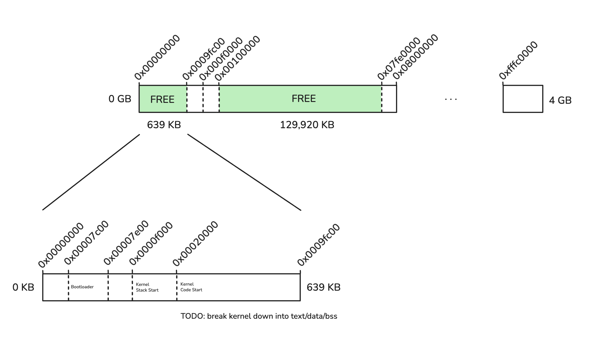

# Interrupts

**High level definition/explanation of interrupts/exceptions**

From the IA32 Vol 3 Manual:

```
Interrupts and exceptions are events that indicate that a condition exists
somewhere in the system, the processor, or within the currently executing
program or task that requires the attention of a processor. 

They typically result in a forced transfer of execution from the currently
running program or task to a special software routine or task called an
interrupt handler or an exception handler.
```

Exceptions

- Faults
- Traps
- Aborts

Interrupts

- External/hardware
- Software


Non-maskable interrupt

IF Flag / disabiling interrupts

**Interrupt descriptor table + entries**

**Traps/Faults/Interrupts**

**What the stack looks like / what info we get in our handler**

Talk about need to store general purpose registers

**PIC**

Look at chapter 8 of IA32 Vol 3

# Memory Management

