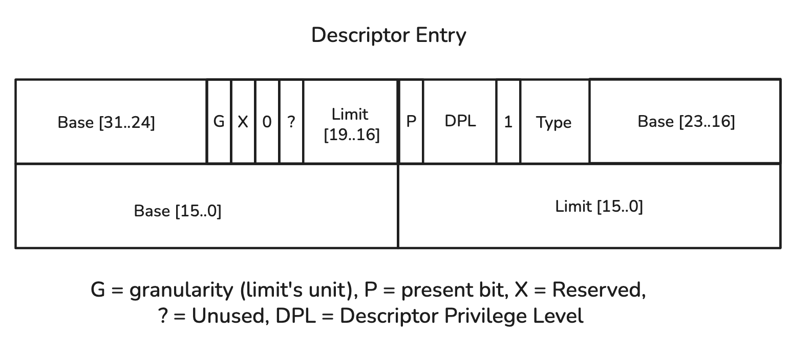
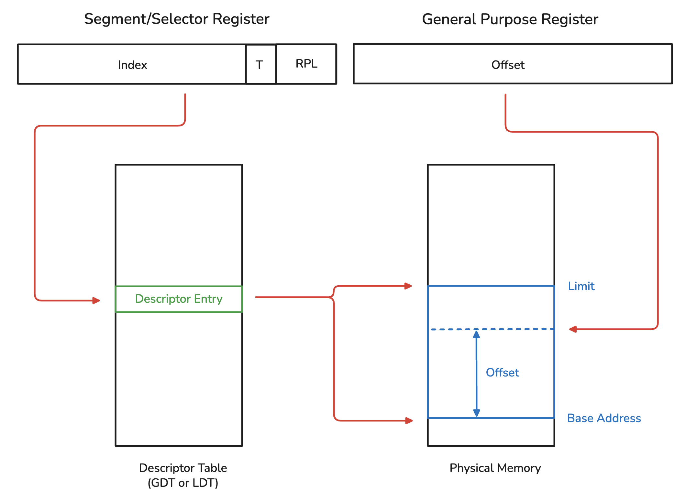

# Overview

This subdirectory contains the bootloader code for the i386 compatible CPUs.

# Background

## Something here

### High level abstract understanding (Generic)

We write our kernel binary onto a hard drive.

When the PC boots, we need to load the kernel binary into memory so that the CPU
can start executing it.

The CPU has a hard-coded "reset vector", which is the location from which
execution will begin when it is powered on. This points to an executable binary
in ROM/flash which is responsible for finding the location of the bootloader
binary on the hard disk, loading it into memory, and then jumping to it.

The bootloader is then responsible for locating a bootable OS kernel, loading it
into memory, and then jumping to its entry point.

### Slightly more detail (qemu-system-i386 + SeaBIOS)

When the CPU is powered on, it sets the instruction pointer (`eip` register) to
`0xFFFFFFF0`, which is the reset vector.

The SeaBIOS binary is loaded at that address, and so it is executed. SeaBIOS
supports loading the kernel from a hard disk, floppy disk, CD or even the
network. Here we look at loading the kernel from a hard disk.

SeaBIOS is configured with a boot device priority, which defines the order in
which it searches for bootable devices. By default, the first device to be
checked is hard drive zero.

To check a hard drive, SeaBIOS: 

- Loads the first sector (512 bytes) into memory at address `0x7c00`
- Looks for the signature `0x55AA` at offset 510
- If present, jumps to `0x7c00`

This means that if we place a binary executable in the first sector of a hard
drive and write 0x55AA as the last two bytes, it will be executed. Therefore,
it's the perfect location for our bootloader.

The bootloader can really do anything we want and can be formatted in any way we
like, with the restriction that it must fit into a single 512 byte sector. If
this first sector contains some code to load in other sectors, then we can load
in another binary from a known location from the hard drive and execute it

Again, we have complete control over exactly how this is done. For example, we
could arbitrarily load the next (after the first) 128 sectors from the disk into
some point in memory and then jump to that (assuming those sectors contain the
kernel code). However, it is very common to format this first sector as a Master
Boot Record (MBR). (There will be another section on this with more info).

There's one other problem: i386 CPUs boot up in what's called 'real mode', and
our bootloader should transition the CPU to 'protected mode'. (There will be
another section on this with more info).

## x86 modes

### Real Mode

Real mode allows a i386 CPU to run 16 bit programs. It exists for backward
compatibility: older software running on newer hardware.

When the CPU boots, it is in real mode by default. This has implications, which
we discuss below.

**Memory addressing**

The CPU does not directly use the addresses "supplied" by instructions.

Instead, it uses a dedicated 16-bit "segment" register to combine the 16-bit address
from the instruction (e.g stored in a register, referred to as offset) with:

```
Physical address = (segment << 4) + offset
```

This has the effect of expanding the total addressable memory. Otherwise, we'd
only be able to access 2^16 = 64KB.

With this scheme, we can access a little over 1MB of memory. Shifting the
segment register left 4 bits means that a memory address consists of 20 bits. In
the past, if the offset causes there to be a 21st carry bit, then the address is
interpreted to "wrap around back to 0". Nowadays, it's possible to actually
access a small amount of memory past 1MB rather than wrapping around (because
modern CPUs have more than 20 address lines).

Rather than having just one segment register, there are six. The one that is
chosen by the MMU depends on the instruction being executed.

- CS = Code Segment (Jmp, Call, Int)
- DS = Data Segment (Mov, Add, Sub, Cmp, etc. - default for most data operations)
- ES = Extra Segment (String operations like Rep Movsb, Scasb as destination)
- SS = Stack Segment (Push, Pop, Call, Ret)
- FS = Additional Segment (General purpose)
- GS = Additional Segment (General purpose)

Instructions can use FS and GS to override the default segment register used
when decoding the address.
 
**BIOS Functions**

The BIOS is an abstraction of low-level hardware details and provides an
interface to executable binaries.

Generally, calling BIOS functions involves:

- Setting the AH register to a particular value
- Calling `INT <opcode>`

These functions can take additional parameters in other registers.

One example of a BIOS function is reading a hard drive sector into memory. We do
this in our basic bootloader and describe the mechanism in detail.

More information about the available BIOS functions can be found [here](https://wiki.osdev.org/BIOS#BIOS_functions).

**Limitations**

You can only address a total on 1MB of memory.

You constantly have to change values in segment registers, which is cumbersome.

There are no built-in hardware memory security mechansims. There's nothing to
stop a malicious task from accessing/modifying data of another task.

There is no support for virtual memory.

### Protected Mode

A really good article on protected mode can be found
[here](https://web.archive.org/web/20030604185154/http://home.swipnet.se/smaffy/asm/info/embedded_pmode.pdf),
particularly good if you already have some understanding of operating systems.

**Memory Addressing**

In protected mode, we have three types of tables that are stored in main memory:
global descriptor table (GDT), local descriptor table (LDT) and the interrupt
descriptor table (IDT).

Each table consists of a series of entries that look like:



The important elements of the entry are the base and the limit.

Each segment register points to one entry in one of these tables, and in turn
these entries are used to translate logical entries in linear physical
addresses as shown below.



In words, when an instruction is executed a segment register is chosen (in the
same way as in real mode) which points to an entry in either the GDT or the LDT.
This entry specifies a base physical address which the offset is added to to get
the linear physical address of the memory location being accessed. The limit is
used to restrict which linear physical addresses can be accessed via the offset.

I'm deliberatly avoiding going into detail here for a few reasons:

- Modern operating systems do not use the LDT and use a small GDT that just
  allows for a flat/direct memory access
- The natural coevolution between CPU design and OS design means that explaining
  the purpose of the LDT requires some pre-requisite knowledge about operating
  systems, and I want this to be "self-contained"

We need to know about this because ultimately the CPU MMU requires that there is
a minimal GDT setup (even if that always results in flat memory accesses).
Therefore, our bootloader will need to set this up when it transitions to
protected mode.

**Hardware Protections**

The protections that the GDT/LDT segmentation model offers is all about
preventing tasks from accessing/modifying things they shouldn't. At this point,
we haven't covered the concept of a task so there's not much point digging into
that further for now.

**Paging**

Again, an understanding of paging isn't needed to get to the point we want so we
don't talk about it.